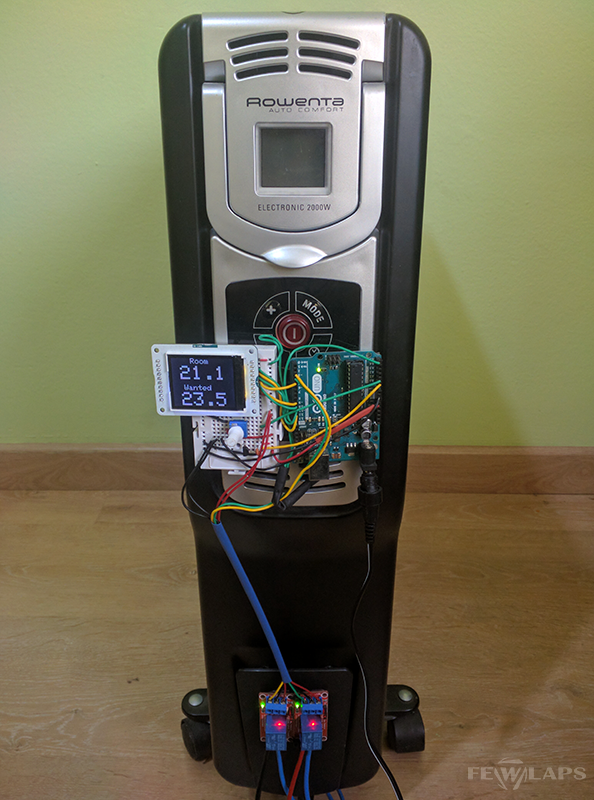

# hottie-room-arduino
Warm your room with this Arduino program

Your electric heater has been broken. You don't know why, but it doesn't respond to any button. It seems the board burnt or something bad like that. You can throw it to the sea or repair it. And, as you are a green person, you've chosen the second option: to get a new Arduino board, some electronic components, install this software, and warm your room again.

